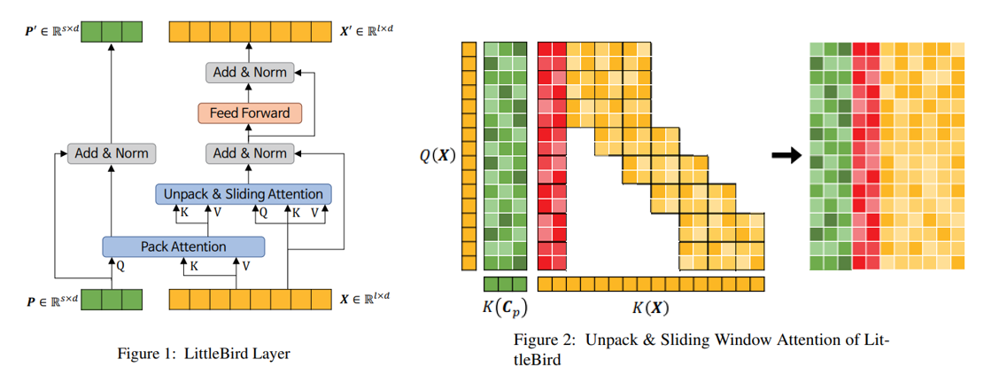

# LittleBird

#### Implementation of LittleBird: Efficient Faster & Longer Transformer for Question Answering


LittleBird is a sparse attention model proposed by Kakao Enterprise Corp. that improves on BigBird by reducing the memory footprint and improving the speed while maintaining accuracy. The model is a combination of BigBird's sliding window attention and LUNA pack and unpack attention with a custom bi-directional positional representation method based on ALiBi. As of `2022.03.08` the model sits at first place on the KorQuad 2.0 test set.




## Installation


During developemnt, I used Python 3.8 and Pytorch 1.12. You can install from source as follows:

```Bash
pip install .
```


## Usage


```Python
import torch

from littlebird import LittleBirdModel

seq_len = 6144
pack_len = 64
vocab_size = 30_000
embed_dim = 768
block_size = 64

encoded = {
    "input_ids": [[1,2,3,4,5,6,7,8,9,10] + [0]*(seq_len-10)],
    "attention_mask":[[1,1,1,1,1,1,1,1,1,1] + [0]*(seq_len-10)]
}

m = LittleBirdModel(seq_len, pack_len, vocab_size, embed_dim, block_size=block_size)

m(
    torch.as_tensor(encoded["input_ids"]),
    torch.as_tensor(encoded["attention_mask"]).bool(),
)
```

## Contributing

I implemented this model as a small side project for fun. There may be minor issues with the implementation. I greatly appreciate all contributions. If you have any issues, bug reports, or feature requests, you may open an issue on github. Alternatively, feel free to fork this repository and submit a pull request with your changes.

## References

• [LittleBird: Efficient Faster & Longer Transformer for QuestionAnswering](https://arxiv.org/abs/2210.11870) <br>
• [Big Bird: Transformers for Longer Sequences](https://arxiv.org/pdf/2007.14062.pdf)<br>
• [Luna: Linear Unified Nested Attention](https://proceedings.neurips.cc/paper/2021/file/14319d9cfc6123106878dc20b94fbaf3-Paper.pdf)<br>
• [ALiBi](https://arxiv.org/pdf/2108.12409.pdf)<br>


## Author

Teryn Jones
